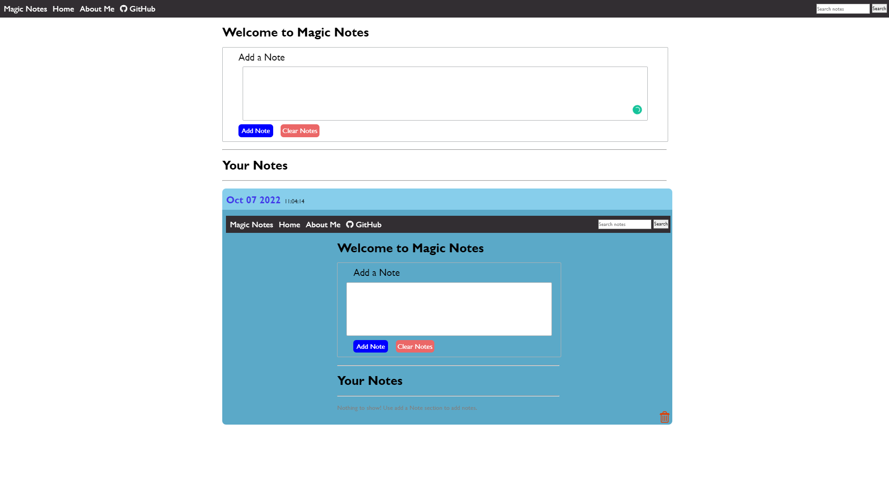

# Notes
https://srbmaury.github.io/notes/
 
Notes are stored in local storage

Paste this HTML code above to see the magic:
https://codepen.io/srbmaury/pen/xxjaxzB

<h1>Preview:</h1>

JS won't work as note. 🙂

<i>The code of main.js has some bugs and it is not in use currently. </i>

<h1>Here you can:</h1>
<ul>
    <li>Add a new note</li>
    <li>Edit your previous notes</li>
    <li>Delete your previous notes</li>
    <li>Star Important notes</li>
    <li>Search within notes</li>
    <li>Sort by newest first and oldest first</li>
<ul>